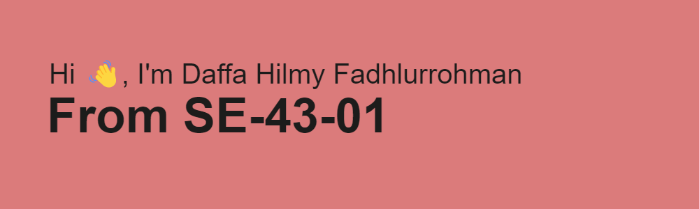

# About this repo
 This repository is intended to fulfill a replacement task for the software configuration 
 management course. The task is to refactor the bad smells code.

# Git Flow

# Code Smells
In the refactor process, there are several findings in the code
| Code Smells | Class |
| ------ | ------ |
| Long Class | Employee |
| Long Parameter | Employee, TaxFunction, User,   |
| Long Method | Employee, TaxFunction, Salary |
| Switch Statement | TaxFunction, Employee, Salary  |
| Primitive Obsession | Employee, Salary |
| Comments | Employee, Salary, TaxFunction  |

# Reference
In this refactoring, several references are used to get a good understanding 
of making improvements to the code.

| Source | Link |
| ------ | ------ |
| RefactoringGuru | https://refactoring.guru/refactoring/smells |
| Uncle Bob | http://cleancoder.com/files/cleanCodeCourse.md |

